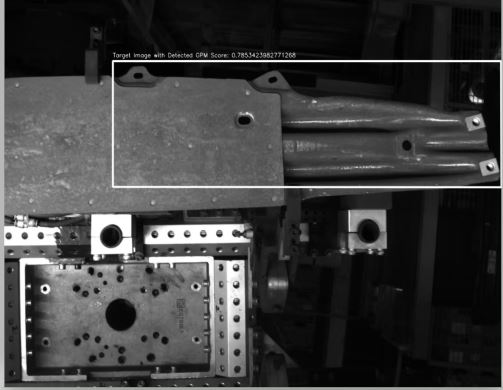

# High level Design Documentation and System Overview 

## Introduction
This project is for iSense vision software V1.0. \
Licensed under keySense LLC 祁新科技有限公司 \
Author Bruce Liu\
Date: 2024/12/06
## Requirements
OpenCV libraries 
Numpy

## System Overview
```mermaid
graph TD;
    A[GUI.py] --> B[left_match.py]
    A[GUI.py] --> C[right_match.py]
    B[left_match.py] --> D[]
```  