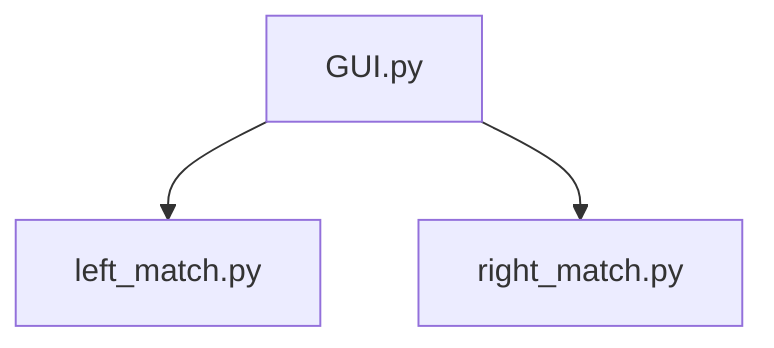

# High level Design Documentation and System Overview 

## Introduction
This project is for iSense vision software V1.0. \
Licensed under keySense LLC 祁新科技有限公司 \
Author Bruce Liu\
Date: 2024/12/06
## Requirements
OpenCV libraries 
Numpy

## System Overview

From each left and right match exe, a confidence score will be generated\
Each score should be 0 to 1 and if the combined score is larger than 0.8, then the part is PASS, else is NG

## Connection and Integration
The current deployment is for TCP camera, so the run time is for RJ45 connection